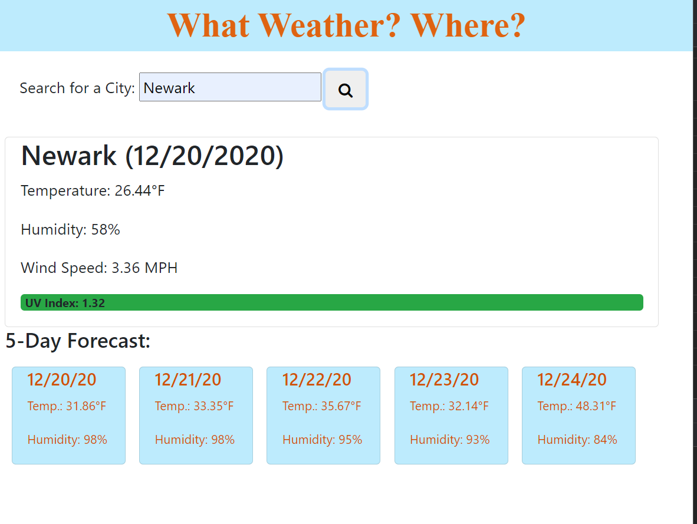

# What_Weather

## Description

This application will give you the current weather for any city you ilicit, as well as the forecast for the next five days. It will also save the city you have searched and recall it on demand.

## Table of Contents

* [Installation](#installation)
* [Usage](#usage)
* [Credits](#credits)
* [License](#license)

## Installation

N/A

## Usage

Type a city you would like to know the weather for in the search bar. Upon clicking on the search button, the current weather and next 5-day forecast will appear in the main module of the page while on the left side panel, your recently searched for cities will appear.

Please follow the following link to the application!
!(https://gabel35.github.io/What_Weather/)

## Credits

openweathermap for providing the date and time variables through their API
fontawesome.com for providing a free, easy to use icons

Thank you to all the TA's for your help and for group 2. Nella Larsen for the teamwork.

### License

N/A

-------------

Thank you!